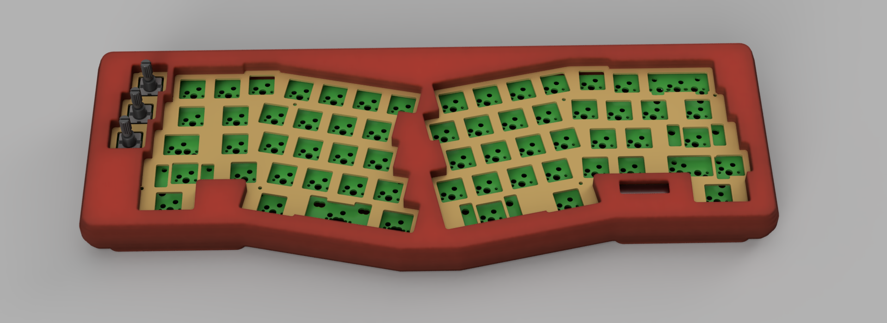

# Geulis
Wireless alice layout keyboard
# Images

# Firmware
[https://github.com/karnadii/geulis_config_module](https://github.com/karnadii/geulis_config_module)

NOTE: My keyboard case is terrible. Make your own case or use someone else's. The RGB drains a lot of battery, but if you cut the power trace to the RGB, the battery life is amazing, thanks to ZMK. I haven't charged my keyboard in over half a year, and it still has more than 50% battery left.

